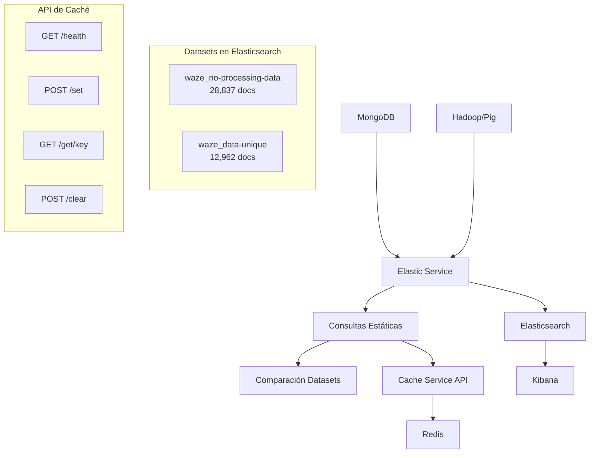

# 📊 Sistema de Consultas Estáticas a Elasticsearch con Caché

> **Rama:** `feature/consultas-estaticas-elasticsearch`

Este sistema implementa consultas estáticas automatizadas que comparan datos procesados vs no procesados en Elasticsearch, guardando solo los resultados de datos procesados en caché Redis.

## 🏗️ Arquitectura



## ✨ Características Principales

### 🔄 Flujo Automatizado
1. **Carga datos sin procesar** desde MongoDB → `waze_no-processing-data`
2. **Carga datos procesados** desde Hadoop → `waze_data-unique`
3. **Ejecuta consultas idénticas** en ambos datasets
4. **Compara resultados** y muestra diferencias
5. **Guarda en caché** solo resultados de datos procesados

### 📊 Consultas Implementadas

| Consulta | Descripción | Datos Raw | Datos Procesados | Reducción |
|----------|-------------|-----------|------------------|-----------|
| **Tipos de eventos** | Agregación por tipo | 28,837 docs | 12,962 docs | 55% |
| **Eventos por comuna** | Top 10 comunas | 28,837 docs | 12,962 docs | 55% |
| **Distribución subtipos** | Análisis detallado | 28,837 docs | 12,962 docs | 55% |
| **Últimas 24 horas** | Eventos recientes | 4,390 docs | 2,385 docs | **45.7%** |
| **Distribución diaria** | Histograma temporal | 28,837 docs | 12,962 docs | 55% |

### 🚀 API de Caché (Puerto 8000)

#### Endpoints Disponibles

```bash
# Estado del servicio
GET http://localhost:8000/health
{
  "status": "healthy",
  "redis": "connected"
}

# Guardar en caché
POST http://localhost:8000/set
{
  "key": "mi_consulta",
  "value": "{\"resultado\": \"datos\"}",
  "ttl": 3600
}

# Obtener del caché
GET http://localhost:8000/get/mi_consulta
{
  "found": true,
  "key": "mi_consulta", 
  "value": "{\"resultado\": \"datos\"}"
}

# Limpiar caché
POST http://localhost:8000/clear
{
  "success": true,
  "message": "Cache limpiado"
}
```

## 🛠️ Uso del Sistema

### Inicio Rápido

```bash
# 1. Levantar el sistema completo
docker-compose up -d

# 2. Verificar estado del caché
curl http://localhost:8000/health

# 3. Ejecutar pruebas completas
./test_consultas.sh

# 4. Ver resumen del sistema
./resumen_sistema.sh
```

### Verificación Manual

```bash
# Ver consultas guardadas en caché
curl http://localhost:8000/get/consulta_estatica:total_de_eventos_por_tipo | jq .

# Ejecutar consulta personalizada a Elasticsearch
curl -X POST 'http://localhost:9200/waze_data-unique/_search' \
  -H 'Content-Type: application/json' \
  -d '{
    "size": 0,
    "aggs": {
      "tipos": {
        "terms": {"field": "tipo", "size": 10}
      }
    }
  }' | jq .

# Ver índices disponibles
curl 'http://localhost:9200/_cat/indices/waze*?v'
```

## 📈 Resultados Actuales

### Reducción por Deduplicación
- **Datos originales:** 28,837 documentos
- **Datos únicos:** 12,962 documentos  
- **Reducción:** 55.0% (15,875 duplicados eliminados)

### Consultas en Caché
- ✅ **5/5 consultas** guardadas exitosamente
- ⏱️ **TTL:** 1 hora por consulta
- 🔄 **Actualización:** Automática al recargar datos

### Diferencias Detectadas
- **Eventos últimas 24h:** 45.7% reducción (4,390 → 2,385)
- **Todos los datasets:** 55% reducción constante por deduplicación

## 🔧 Configuración

### Variables de Entorno
```bash
# Redis (definido en redis.env)
REDIS_HOST=redis-exp-lfu
REDIS_PORT=6379

# Elasticsearch
ELASTICSEARCH_URL=http://elasticsearch:9200

# Kibana  
KIBANA_URL=http://kibana:5601
```

### Puertos Expuestos
```yaml
elasticsearch: 9200
kibana: 5601
cache-service: 8000
hadoop-namenode: 9000, 50070
redis: 6383
```

## 📊 Servicios Disponibles

| Servicio | URL | Descripción |
|----------|-----|-------------|
| **Elasticsearch** | http://localhost:9200 | Motor de búsqueda y análisis |
| **Kibana** | http://localhost:5601 | Visualización (Data Views automáticos) |
| **Cache API** | http://localhost:8000 | API REST para gestión de caché |
| **Hadoop NameNode** | http://localhost:50070 | Interfaz web de Hadoop |

## 🧪 Scripts de Prueba

### `test_consultas.sh`
```bash
./test_consultas.sh
```
- ✅ Verifica estado del caché
- ✅ Lista consultas guardadas  
- ✅ Ejecuta consultas personalizadas
- ✅ Prueba escritura/lectura manual

### `resumen_sistema.sh`
```bash
./resumen_sistema.sh
```
- 📊 Dashboard completo del sistema
- 📈 Estadísticas de reducción
- 🔗 Enlaces rápidos a servicios
- 💡 Comandos útiles

### `test_consultas.py`
```bash
python3 test_consultas.py
```
- 🐍 Versión Python para pruebas avanzadas
- 📊 Consultas programáticas
- 🔄 Comparación de datasets

## 🗂️ Estructura de Archivos

```
├── cache-service/src/main.py      # API REST de caché
├── elastic/src/main.py            # Sistema de consultas estáticas  
├── docker-compose.yml             # Puerto 8000 para caché
├── test_consultas.sh              # Script de pruebas
├── resumen_sistema.sh             # Dashboard del sistema
├── test_consultas.py              # Pruebas en Python
└── .gitignore                     # Exclusiones actualizadas
```

## 🎯 Casos de Uso

### 1. Análisis de Duplicados
```bash
# Ver diferencia entre datasets
curl http://localhost:8000/get/consulta_estatica:total_de_eventos_por_tipo
```

### 2. Consultas en Tiempo Real
```bash
# Búsqueda personalizada sin caché
curl -X POST 'http://localhost:9200/waze_data-unique/_search' \
  -d '{"query": {"term": {"tipo": "JAM"}}}'
```

### 3. Monitoreo de Performance
```bash
# Estado del sistema completo
./resumen_sistema.sh
```

## 🚀 Próximas Mejoras

- [ ] **Consultas personalizadas** vía API
- [ ] **Alertas automáticas** por cambios significativos
- [ ] **Dashboard web** para visualización
- [ ] **Métricas de performance** en tiempo real
- [ ] **Exportación de reportes** en PDF/Excel

---

> 💡 **Tip:** Usa `./resumen_sistema.sh` para obtener un overview completo del estado actual del sistema.

> 🔗 **Enlaces rápidos:** [Elasticsearch](http://localhost:9200) | [Kibana](http://localhost:5601) | [Caché](http://localhost:8000/health)
